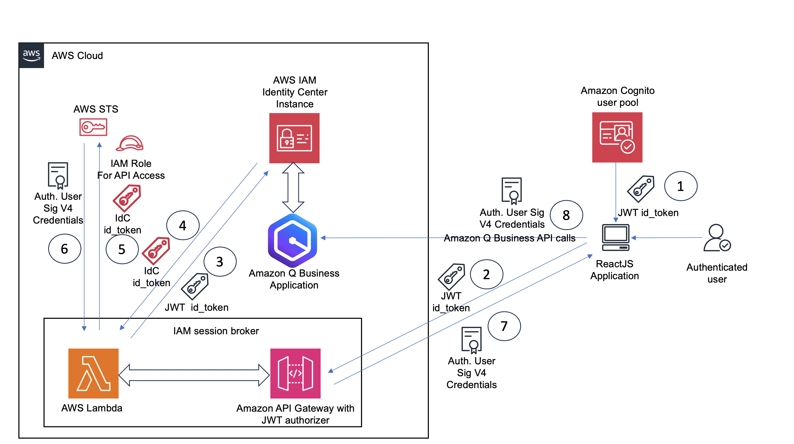
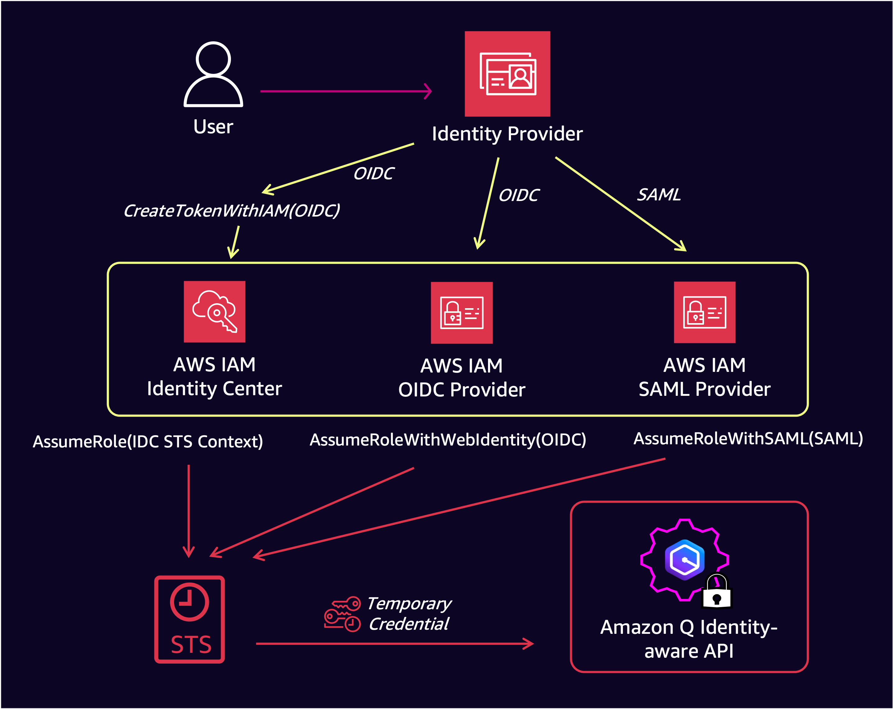
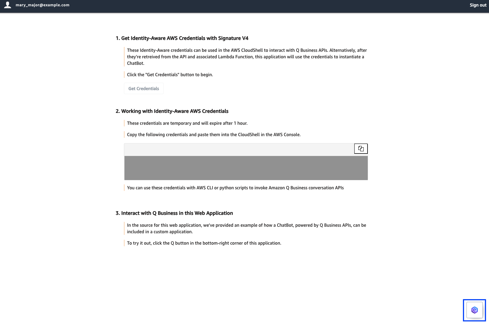
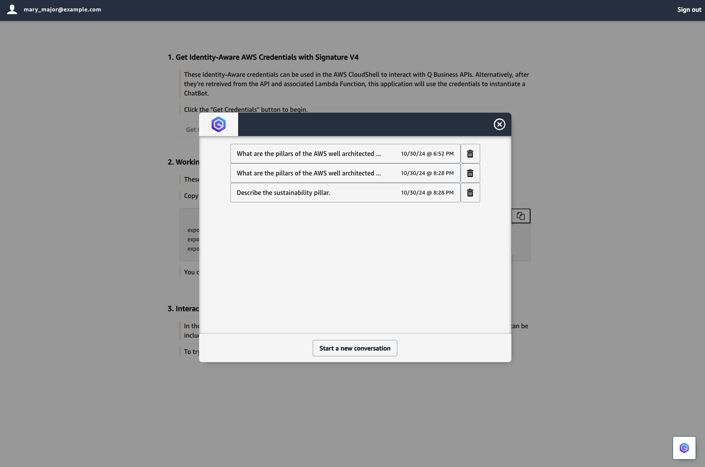

# Integrate your application with Amazon Q Business Identity-aware APIs

[Amazon Q Business](https://aws.amazon.com/q/business/) is a fully managed, permission aware generative artificial intelligence (AI)-powered assistant built with enterprise grade security and privacy features. Amazon Q Business can be configured to answer questions, provide summaries, generate content, and securely complete tasks based on your enterprise data. The native data source connectors provided by Amazon Q Business can seamlessly integrate and index content from multiple repositories into a unified index.

Amazon Q Business comes with rich API support to perform administrative tasks or to build an AI-assistant with customized user experience for your enterprise. With administrative APIs you can automate creating Q Business applications, set up data source connectors, build custom document enrichment, and configure guardrails. With conversation APIs, you can chat and manage conversations with Q Business AI assistant.

You can use Q Business APIs to build customized user experiences for your enterprise. With this sample, you'll learn how to integrate your application with Amazon Q Business Identity-aware APIs for secure and private conversations.

## What You'll Build

### Identity-aware API

The conversation APIs are identity-aware and use identity tokens generated by your identity provider as user context, enhancing Amazon Q Business's privacy controls. [AWS IAM Identity Center](https://aws.amazon.com/iam/identity-center/) and [AWS IAM Federation](https://docs.aws.amazon.com/IAM/latest/UserGuide/id_roles_providers.html) services help AWS account administrators set up and manage authorized identity providers for AWS services that support identity-aware APIs, such as [Amazon S3](https://aws.amazon.com/s3/) and [Amazon Q](https://aws.amazon.com/q).

## Instructions

### For use with an AWS-led Workshop Event

This repository contains content which is used during an AWS Workshop. If you are attending one of these events, follow the directions of the workshop.

### For use in your own AWS Account

#### Pre-Requisites

The CloudFormation Template assumes that your account already has AWS IAM Identity Center configured as well as a Q Business Application created.

1. [Create AWS Iam Identity Center Instance](https://docs.aws.amazon.com/singlesignon/latest/userguide/create-account-instance.html)
2. [Create Q Business Application](https://docs.aws.amazon.com/amazonq/latest/qbusiness-ug/create-app.html)
3. [Create Q Business Retriever](https://docs.aws.amazon.com/amazonq/latest/qbusiness-ug/select-retriever.html)

Your Q Business Application must be able to answer the questions you ask from the front-end. If you want the Q Business Application to answer all questions (questions not strictly related to your data sources), you can use these instructions to allow Amazon Q to fall back to LLM knowledge. 

4. [Allow Amazon Q to fall back to LLM knowledge](https://docs.aws.amazon.com/amazonq/latest/qbusiness-ug/guardrails-global-controls.html)

#### Deploy the CloudFormation Template

The Cloud Formation Template will create a Cognito Userpool, Cognito Userpool Users, Users and a Group in your Identity Center Instance, a Lambda Function for retreiving Identity-Aware Credentials for those users, and an API for the front end application to call - to interact with that Lambda function.

First, clone the repository with `git clone https://github.com/aws-samples/integrate-your-application-with-amazon-q-business-identity-aware-apis.git`

1. In the AWS Console, navigate to CloudFormation and click the "Create Stack" drop-down and select "With new resources (standard)"
2. Under Specify template, select the "Upload a template file" option.
3. Click the "Choose File" button, and upload the `./integrate-your-application-with-amazon-q-business-identity-aware-apis/infra/tte-gw-lambda-idc.yaml` template; click "Next".
4. Name your stack.
5. Provide IdentityCenterInstanceId - you can find this in the AWS Console by navigating to AWS Iam Identity Center. Under "Settings summary", use the "Organization Id"
6. Provide QBusinessApplicationId - you can find this in the AWS Console by navigating to Amazon Q Business. Under "Applications", click the name of the application (not the radial selector). Use "Application ID" which is displayed under the "Application Settings" section.
7. Click "Next"
8. On the "Configure stack options" screen, use all of the default values. Under the "Capabilities" section, click the acknowledgement checkbox, signalling that you understand the template will create IAM resources.
9. Click "Next"
10. On the "Review and Create" screen, scroll down to the bottom and click "Submit".

#### Configure Amazon Q For Business Application

Now that the above is created, you'll need to give the newly created Identity Center users access to your Q Business Application Manually.

1. In the AWS Console, navigate to Amazon Q Business. Under "Applications", click the name of the application (not the radial selector).
2. In the top-right of the "User Access" section, click "Manage user access".
3. Next, click "Add groups and users", and select the "Assign existing users and groups" option; click "Next"
4. In the "Search by user display name or group name" text input, type `AllUsers`, and wait for the lookup to populate the group. When it shows up, click on it.
5. Click "Assign", and leave the Subscription as `Q Business Pro`
6. Click "Confirm"

#### Configure and Deploy React Application

With the group of users added to your Q Business Application, you can configure and deploy the React Application.

##### Configure

First let's download and change the configuration of the react application so that it uses the outputs from CloudFormation.

1. In the AWS Console, navigate to CloudFormation, and select the Stack which you deployed earlier. 
2. In the resulting screen, click on the "Outputs" tab.  
3. Open the AWS CloudShell using the button in the bottom left of the AWS Console.
4. Download this repository with `git clone https://github.com/aws-samples/integrate-your-application-with-amazon-q-business-identity-aware-apis.git`
5. Run this command `vim /home/cloudshell-user/integrate-your-application-with-amazon-q-business-identity-aware-apis/app/public/config.js`
6. Copy the value of the `ConfigJS` output from the CloudFormation Stack, and in CloudShell, use arrow keys to scroll down to the line which starts `const config =`. While your cursor is on these lines, delete them using the "d" key (hint: you have to pres the d key twice to delete a single line).
7. Now you can enter insert mode by pressing the "i" key, and then "ctrl/cmd + v" to paste the value which you copied from CloudFormation. 
8. To save and close the vim editor, press the "esc" key, and then use these keys in succession: ":wq!" - hit the "enter/return" key.

Now we can install all package dependencies:
1. Execute `cd /home/cloudshell-user/integrate-your-application-with-amazon-q-business-identity-aware-apis/app`
2. Execute `npm install` - this may take a minute or two.

Now we can build the application:
1. Execute `npm run build`
2. To prepare for deployment, compress the contents of `./app/dist` into a .zip folder with `cd /home/cloudshell-user/integrate-your-application-with-amazon-q-business-identity-aware-apis/app/dist && zip -r ../archive.zip *`
3. Download archive.zip. Click the "Actions" downdown in Cloudshell in the top right, and enter this file path: `/home/cloudshell-user/integrate-your-application-with-amazon-q-business-identity-aware-apis/app/archive.zip`

##### Deploy

1. In the AWS Console, navigate to AWS Amplify.
2. Click the "Create new app" button.
3. Click the "Deploy without Git" button, and click "Next".
4. Click the "Choose .zip folder" button, and upload the compressed dist folder's zip file that you just downloaded.
5. Click "Save and deploy". 

The application should deploy quickly, after which you can click the URL found under `Domain` to access the deployed application.

### Using the Application

Once you're at the application, you're presented with a log-in screen.

You can use any of the following users to log in:
- martha_rivera@example.com
- pat_candella@example.com
- mateo_jackson@example.com
- john_doe@example.com
- mary_major@example.com

Use the temporary password: `re:Invent2024`, and you'll be forced to change the password of the user.

Now you can use the application.

#### Get Identity-aware Credentials

1. Click the `Get Credentials button` to begin.
2. Then a button to bring up the Q Chatbot interface component will appear in the bottom-right side of the application.

3. The APIs have been used to populate previous conversations for the user you're loged in as. It is likely that you don't have any previous conversations for the currently authenticated user, so click the `Start a new conversation` to interact with your Amazon Q Business Application.

## Cleanup

Deleting the CloudFormation Template will result in the deletion of most resources that were created, but you will need to manually delete the following.

1. IAM Identity Center

In Users, delete the following:
    - martha_rivera@example.com
    - pat_candella@example.com
    - mateo_jackson@example.com
    - john_doe@example.com
    - mary_major@example.com

In Groups, delete the following:
    - ML_SME_SA
    - SA
    - DB_SME_SA
    - Admins
    - AllUsers
